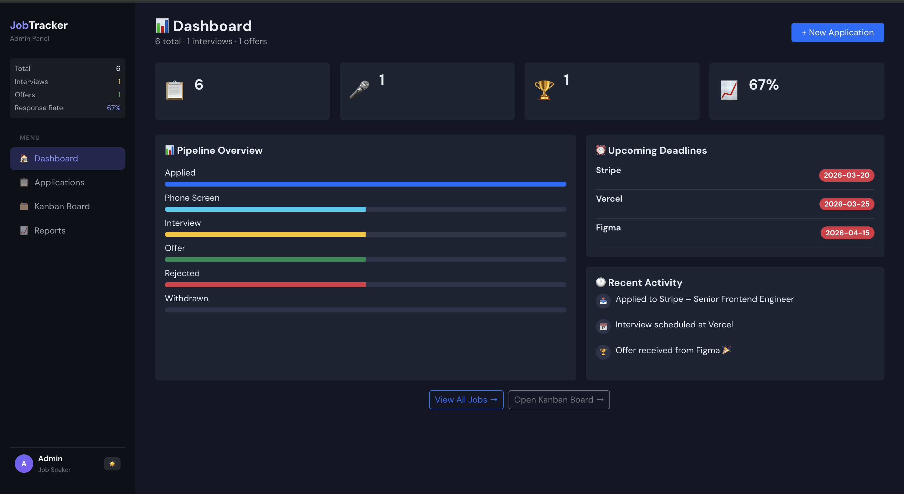
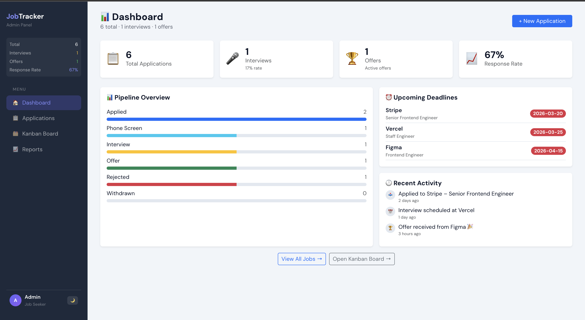
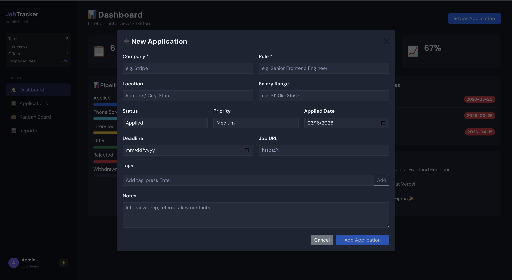
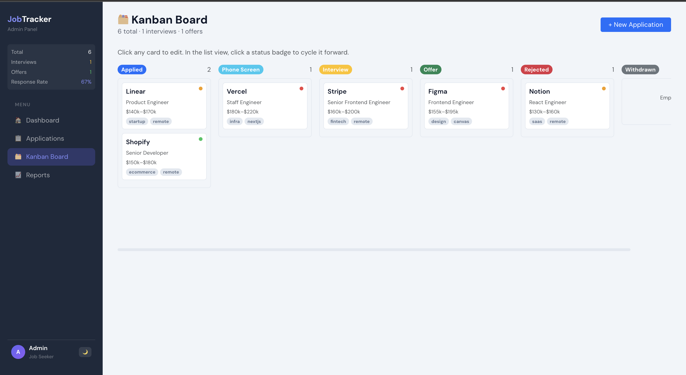
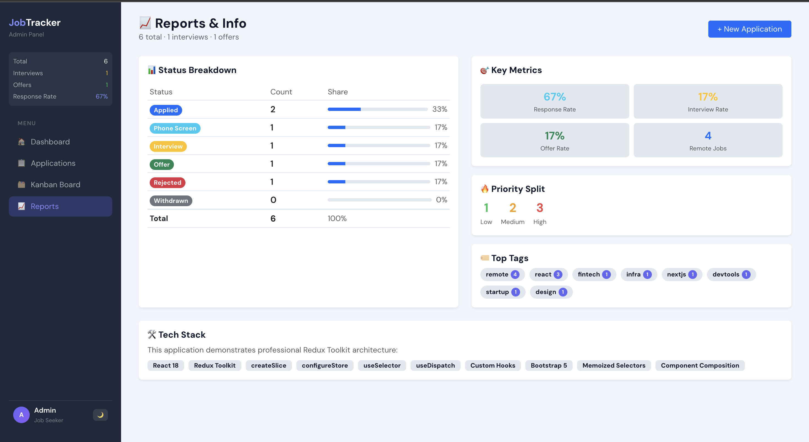

# JobTracker Admin Panel

A full-featured job application tracker built with **React 18**, **Redux Toolkit**, and **Bootstrap 5**.

## 🚀 Getting Started

```bash
npm install
npm start
```

Opens at `http://localhost:3000`

---

## 🗂 Project Structure

```
src/
├── store/
│   ├── index.js                  # configureStore
│   └── slices/
│       ├── jobsSlice.js          # jobs CRUD + selectors
│       ├── uiSlice.js            # view, filter, sort, search, theme
│       └── activitySlice.js      # activity log
│
├── hooks/
│   └── index.js                  # useFilteredJobs, useIsDeadlineSoon
│
├── utils/
│   └── index.js                  # exportJobsToCSV, buildActivityMessage
│
├── constants/
│   └── index.js                  # STATUS, PRIORITY, NAV_ITEMS, SAMPLE_JOBS
│
├── components/
│   ├── Shared/                   # StatCard, StatusBadge, PriorityDot
│   ├── Layout/                   # Sidebar, Topbar
│   ├── Jobs/                     # JobRow, JobModal, JobsToolbar
│   └── Kanban/                   # KanbanCard, KanbanColumn
│
├── pages/
│   ├── Dashboard.jsx
│   ├── JobsView.jsx
│   ├── KanbanView.jsx
│   └── ReportsView.jsx
│
├── App.jsx                       # Root component, modal state
└── index.jsx                     # ReactDOM + Provider entry
```

---

## ✨ Features

| Feature | Details |
|---|---|
| **Redux Toolkit** | `createSlice`, `configureStore`, co-located selectors |
| **3 Slices** | `jobsSlice`, `uiSlice`, `activitySlice` |
| **Custom Hooks** | `useFilteredJobs()` memoizes filter + sort logic |
| **Dashboard** | Stats, pipeline chart, deadlines, activity feed |
| **Jobs Table** | Search, filter, sort, inline status cycling |
| **Kanban Board** | 6-column board, click to edit |
| **Reports** | Status %, priority split, tag cloud, key metrics |
| **CSV Export** | One-click export of all applications |
| **Dark / Light Mode** | Toggled via Redux `uiSlice` |
| **Deadline Alerts** | Red warning if deadline within 3 days |

---

## 🛠 Tech Stack

- **React 18** — functional components, hooks
- **Redux Toolkit** — `createSlice`, `configureStore`, `useSelector`, `useDispatch`
- **react-redux** — `Provider`, typed hooks
- **Bootstrap 5** — via CDN, utility classes
- **DM Sans** — Google Fonts

---

## 📦 Key Redux Patterns Used

### Slice with co-located selectors
```js
// store/slices/jobsSlice.js
export const selectJobStats = (state) => { ... };
export const selectUpcomingDeadlines = (state) => { ... };
```

### Memoized derived state in custom hook
```js
// hooks/index.js
export const useFilteredJobs = () => {
  return useMemo(() => { ... }, [jobs, filter, sort, search]);
};
```

### Clean dispatch from components
```js
dispatch(addJob(formData));
dispatch(addActivityLog({ text: "...", time: "just now", icon: "send" }));
```
## 📸 Screenshots

### Dashboard — Dark Mode


### Dashboard — Light Mode


### Applications Table


### Kanban Board


### Reports

